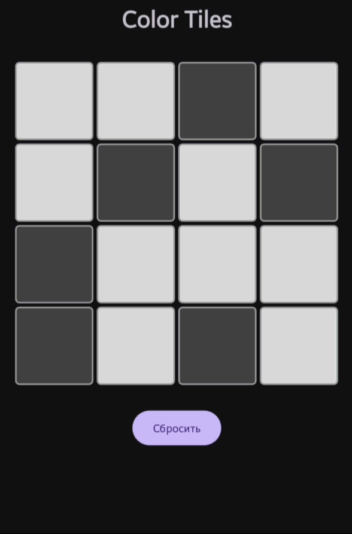
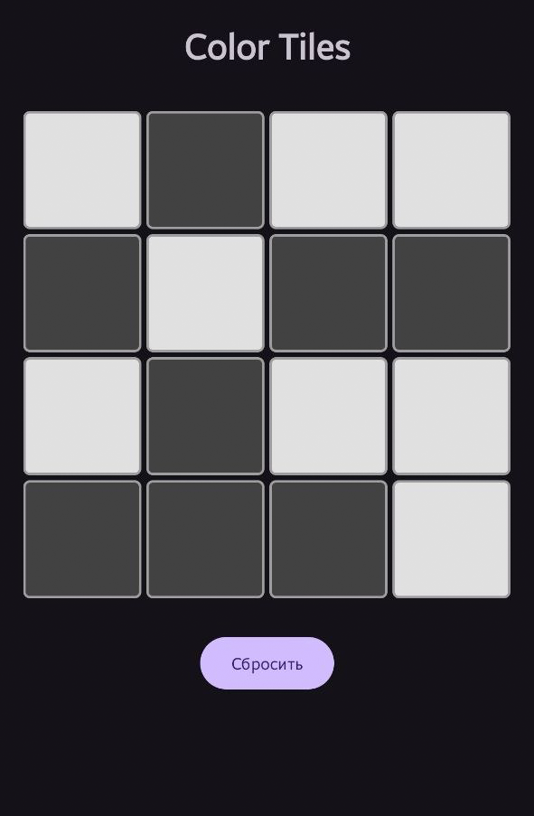
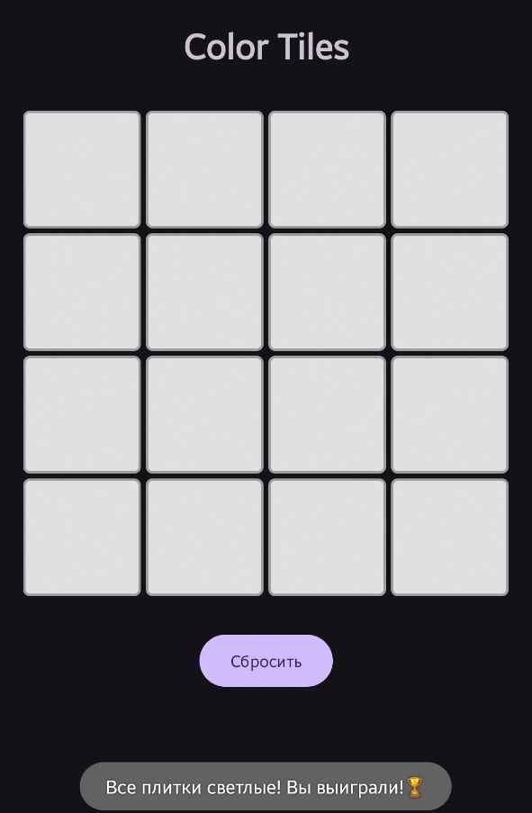

# Color Tiles

Лабораторная работа по дисциплине "Программирование для мобильных платформ"

## Описание
Головоломка Color Tiles - это игра на логику, где необходимо привести все плитки игрового поля к одному цвету (светлому или темному). При нажатии на любую плитку меняют свой цвет все плитки, находящиеся на той же горизонтали и вертикали.

## Технологии
- Язык: Java
- Минимальная версия Android: API 21 (Android 5.0)

## Скриншоты

